# Visual identity · directions and ideas

Recorded 8 Oct 2026. The author chose **A · Manuscript of the House of Wisdom** and asked for the other designs to be kept here for future reference and ideas. Two constraints came with the choice: the deck is **light**, and it uses **Arabic and Hebrew** alongside English.

`identity-mockups.html` shows all nine mock-up slides (open it in a browser; it loads its fonts from Google Fonts). `make-mockups.py` regenerates it. The screenshots are in `img/`.

The Arabic and Hebrew in the mock-ups are working translations, to be checked by native speakers before they go on the site: the title, *al-Madina al-Fadila* (המדינה/העיר המעולה), *sa'ada* (السعادة / האושר) and *Bayt al-Hikmah* (بيت الحكمة / בית החכמה). The Hebrew for "the Virtuous City" is the least certain; the medieval Hebrew translations of Al-Farabi may use another term.

## v1 · the Accords look (4–5 Oct 2026, superseded)

The first pass copied the Islamabad Accords deck's identity: dark navy (`#0a1628`), gold (`#c9a84c`), Instrument Serif, JetBrains Mono, Source Sans 3, emoji headers and cards. It worked, but read as a reskin of the Accords. It lives in git history up to commit `cf2f882`.

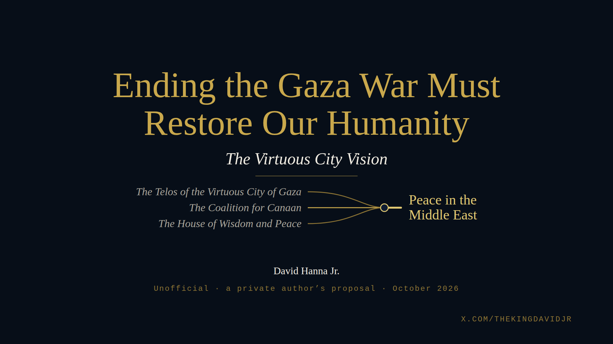 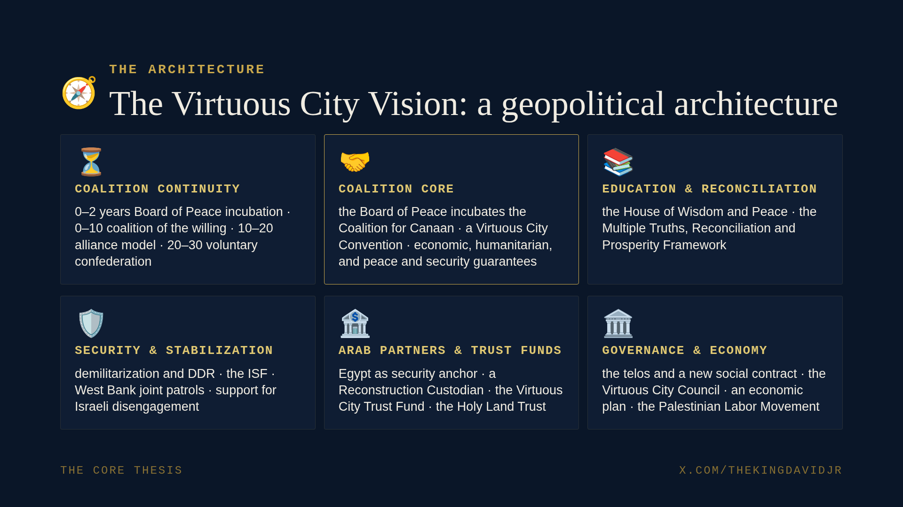 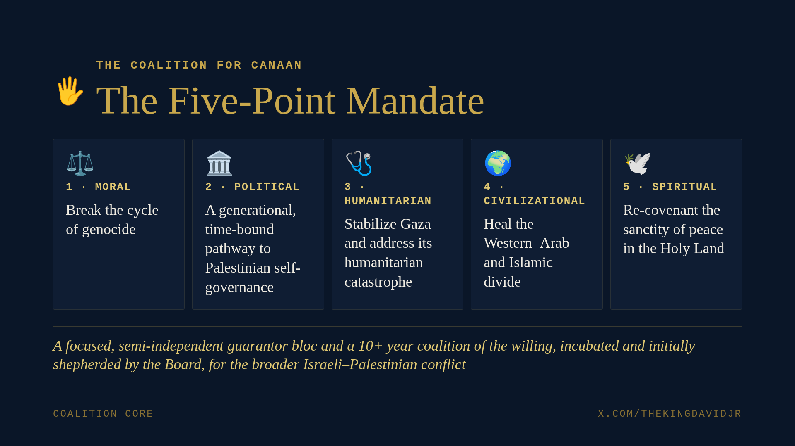 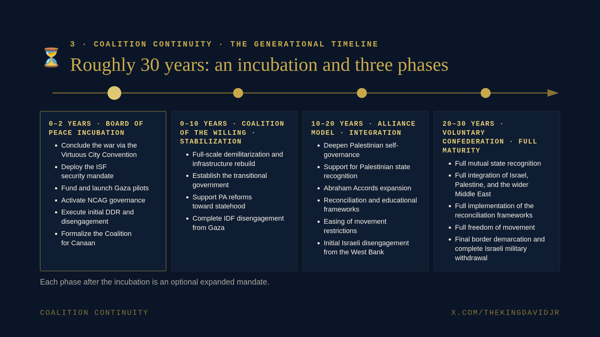

## A · Manuscript of the House of Wisdom (chosen)

- **Idea:** the plan's soul is Al-Farabi and the House of Wisdom, so the deck should look like it came out of that tradition, not a think tank.
- **Palette:** parchment `#f3ead6`, ink `#2a2118`, lapis `#1f3d73`, terracotta `#a3442a`, gold `#a8823a` (borders and ornament, not body text), rule `#c9b48a`.
- **Type:** EB Garamond; Amiri for Arabic; Frank Ruhl Libre for Hebrew.
- **Ornament:** a double gold frame and a band of eight-pointed girih stars along the top; an eight-pointed star as the divider.
- **Architecture slide:** a medieval rota (wheel diagram). Six wedges for the six blocks around a centre that reads "The telos" with السعادة / האושר, titled with Farabi's "six organs of one healthy body".
- **Timeline:** a quiet Gantt with rounded bars over years 0–30; the 0–2 incubation visibly overlaps the first decade.

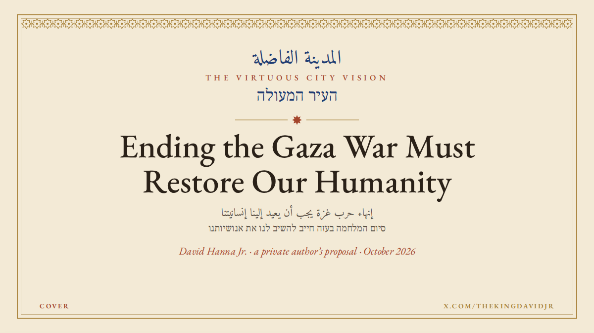 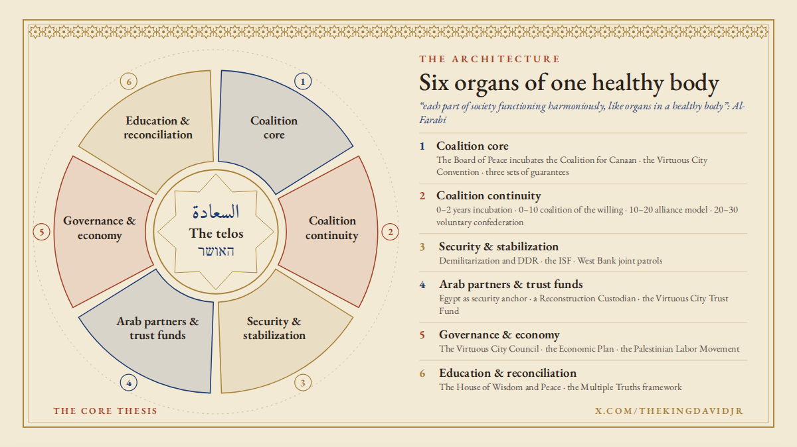 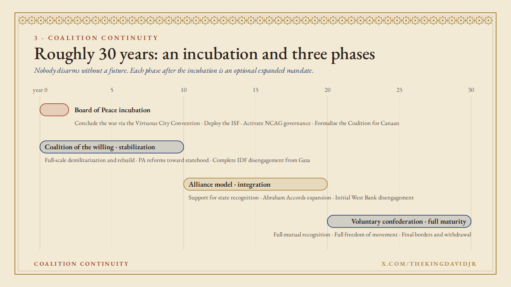

## B · Jerusalem stone and olive (not chosen; ideas to keep)

- **Palette:** limestone `#ebe3d3` / `#ded3bd`, olive `#5d6b2e`, sea blue `#22677f`, deep red `#8c2f2a`.
- **Type:** Marcellus (inscriptional headings) and Lora; Reem Kufi for Arabic headlines and Noto Naskh Arabic for running text; David Libre for Hebrew.
- **Ideas worth reusing:**
  - **The arched window** framing the cover (or a quotation slide).
  - **An arcade of six arches** for the six blocks, with the Board of Peace as the keystone holding them up.
  - **A timeline built like a wall,** course by course, with the incubation as the foundation stone. It reads well as a metaphor ("built from the foundation up") but is the least legible chart of the three.
  - **Olive sprigs** as a small ornament.

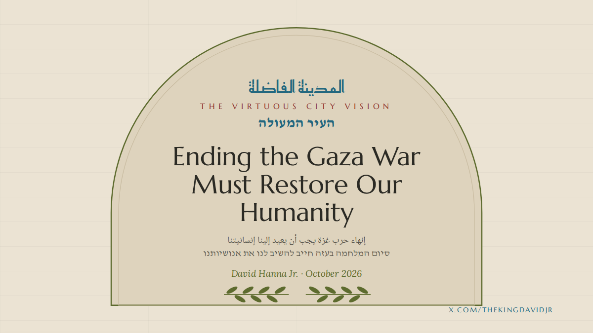 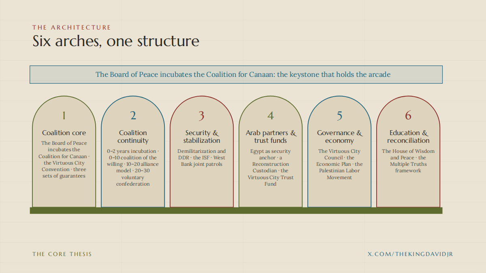 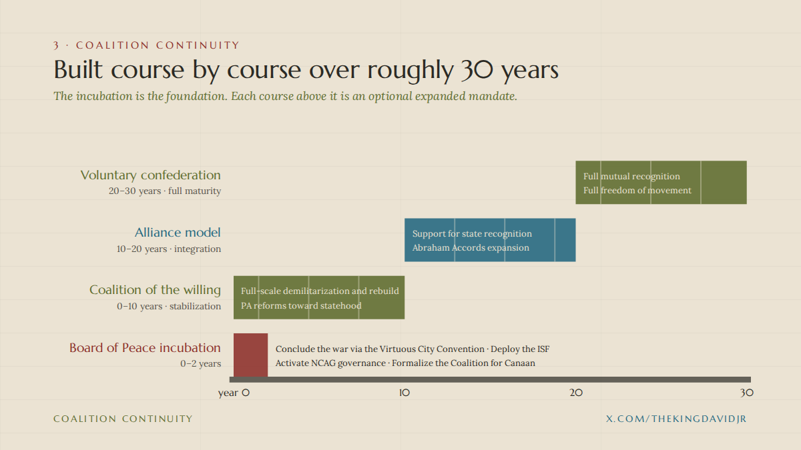

## C · The Round City plan (not chosen; ideas to keep)

- **Palette:** drafting paper `#f7f6f1` with a 48px grid, ink navy `#1c2a42`, teal `#0f6e6a`, red `#b8452a`.
- **Type:** IBM Plex Sans, IBM Plex Sans Arabic, IBM Plex Sans Hebrew (one family across all three scripts) and IBM Plex Mono for labels.
- **Ideas worth reusing:**
  - **Baghdad's Round City (762), home of the House of Wisdom, as a master map.** Six districts around the telos at the centre, numbered 01–06. This could become the one recurring diagram inside A, zooming into a district per section.
  - **Slides as numbered "sheets"** of a plan.
  - **A technical Gantt** with arrowheads and a mono year axis.

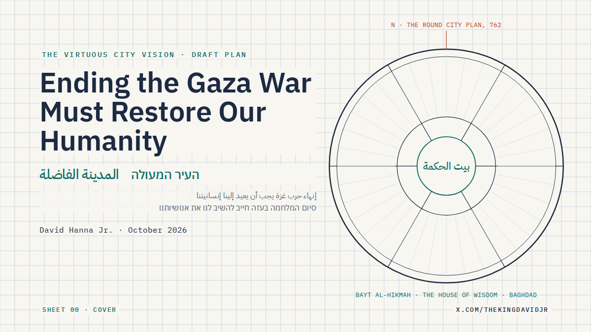 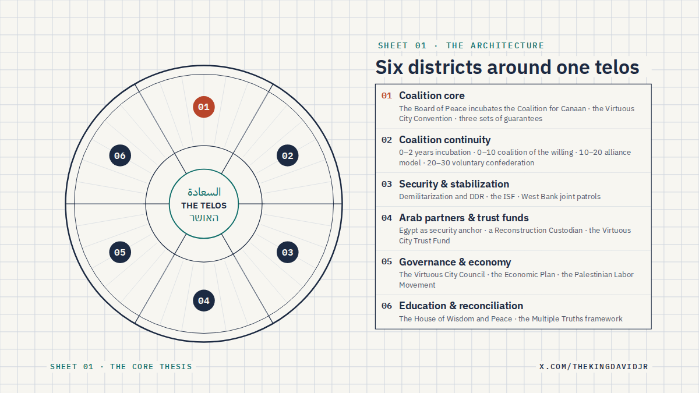 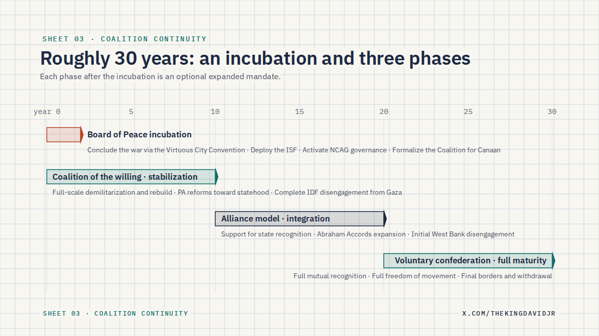

## Infographic ideas (from the 5 Oct brainstorm, for any direction)

- **The core thesis:** the malformed bone, drawn as broken, badly set, refractured, then reset properly.
- **The architecture:**
  - The six blocks as Farabi's organs of a healthy body, or as districts of a city.
  - Arrows for the real flows: Board of Peace → Coalition → guarantees.
- **The telos:**
  - Concentric rings for Farabi's hierarchy of happiness: person, city, nation, humanity, the divine.
  - A lineage of the idea: Plato → Medina → Al-Farabi → Gaza.
- **Coalition core:**
  - An incubator lifecycle: incubate, then spin off.
  - Members as concentric rings (core, additional, ISF contributors) on a regional map.
  - A world map of the repeatable fault lines.
- **Coalition continuity:** a true Gantt, with milestones as markers and each phase boundary labelled "optional expanded mandate".
- **Security:**
  - A two-sided ladder pairing each step of withdrawal with a step of disarmament.
  - A DDR pipeline: weapons in, the Reconstruction Corps out.
- **Freedom of movement:** a flow of stay / leave / resettle / return, marking which choices are reversible.
- **Arab partners & trust funds:** a money flow. Frozen Iranian assets, Board of Peace matching and donors feed the Trust Fund; it runs with the World Bank and through the Custodian to the PA's 56 programs.
- **The West Bank:** a schematic of the two ledgers. Contiguity easements in green; settlement footprints frozen and outlined.
- **Governance & economy:**
  - A Gaza map with the seaport, the Gaza Marine field and the IMEC corridor.
  - An org chart for the Council, the Labor Movement and the Board of Peace.
- **Rehumanization:**
  - A three-circle Venn of the Abrahamic traditions.
  - A branching tree for Shared Canaanite ethnogenesis: a common root that divides and mixes again.
- **House of Wisdom:** a timeline from 9th-century Baghdad, through the transmission to Europe, to Gaza.

Charts with figures (costs, asset totals, casualties) need sourced data; add them only with sources the author approves. The ideas above are structural and need only the author's words.
